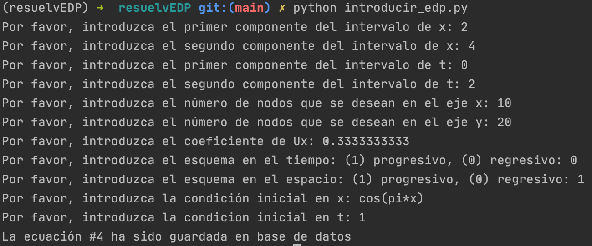
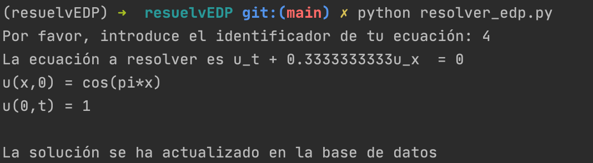
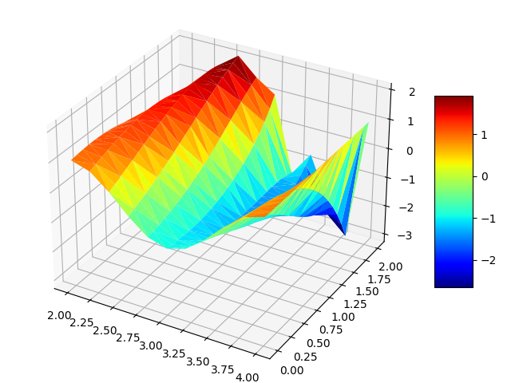

# ResuelvEDP

En gran parte de las ecuaciones en derivadas parciales (EDPs) no es posible obtener una solución exacta, debido a su complejidad. Es por ello que, frecuentemente, se recurre a métodos numéricos que nos permiten obtener soluciones aproximadas y bastante acertadas, en comparación con la exacta. Es el caso del **método en diferencias finitas**, mediante el cual obtenemos esquemas numéricos y soluciones discretas.

En nuestro caso, aplicaremos el método de las diferencias finitas a la **ecuación del transporte**, la cual viene dada por:


con  y  la condición inicial.

Así pues, realizaremos discretizaciones uniformes (tamaños de paso fijos) en tiempo y en espacio para unos ciertos intervalos (obteniendo una malla cuadrangular de nodos), y hallaremos soluciones numéricas mediante **4 esquemas numéricos** distintos (progresivo o regresivo en tiempo , y progresivo o regresivo en espacio ). Todo ello lo programamos mediante **Python** y **bases de datos**, creando finalmente un programa que pida los datos iniciales de la ecuación del transporte a resolver y que, posteriormente, calcule los puntos solución de la solución numérica.

El **programa** realizado tiene dos módulos:
* **Módulo de entrada/salida**: utilizamos la instrucción input y la conversión de tipos de datos para validar los que van a entrar en base de datos. La base de datos es _SQLite_, y hemos creado un módulo para incluir de forma abstracta cualquier tipo de datos en cualquier tabla, siempre y cuando estén validados.
* **Módulo de cálculo**: creamos clases generales de ecuación y clases específicas para cada tipo de ecuación, y usando el patrón de diseño factoría apuntamos al esquema concreto de ecuación del transporte usando como discriminante la progresión o regresión en tiempo y espacio. En un principio lo diseñamos con herencia de clases, pero decidimos separarlo en clases independientes para favorecer la independencia de responsabilidades en cada clase. No obstante, hemos dejado incluido un ejemplo de herencia con clases de ecuación lineal y de segundo grado por cuestiones didácticas.

Hemos utilizado ciertas librerías vistas en clase, como **numpy**, **simpy** y **matplotlib**. Hemos utilizado control de versiones con _GitHub_, y el proyecto será abierto al público una vez se venza el plazo de entrega de trabajos, estará accesible en [ResuelvEDP](https://github.com/jdlcgarcia/resuelvEDP).


## Instalación

El programa se instala con el comando:

```bash
python install.py
```

## Ejecución

```bash
python introducir_edp.py
```
El programa nos solicitará los datos y guardará en base de datos una vez terminadas las solicitudes

```bash
python resolver_edp.py
```
El programa nos solicitará el identificador de la ecuación y mostrará por pantalla los puntos solución, que también actualizará en la base de datos.

## Ejemplo

Ejecución del programa para introducir datos


Ejecución del programa para resolver EDPs


Resultado gráfico de la ejecución


## Contributing
Pull requests are welcome. For major changes, please open an issue first to discuss what you would like to change.

Please make sure to update tests as appropriate.

## License
[MIT](https://choosealicense.com/licenses/mit/)
